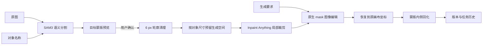

# 架构与执行链路

## 设计目标

Simple Fill 把运行时 Agent 从图像链路中移除。用户确认蒙版并点击生成后，输入、蒙版和参数会被锁定，后端按照同一函数执行。因此结果仍有生成模型的随机性，但“调用了什么、改了哪里、保存了什么”是可复查的。

## 完整流程



### 1. 语义分割

后端把原图上传到 WaveSpeed，并调用 `wavespeed-ai/sam3-image-rle`。文字和点/框是互斥的两类输入：界面默认走文字语义。返回的 RLE 被解码并恢复到原图尺寸。

### 2. 编辑区域构造

SAM3 蒙版只描述旧对象。为避免旧轮廓残留、也允许新对象略大于旧对象，系统取以下两者的较大值作为外扩半径：

```text
max(dilation_px, max(target_width, target_height) × growth_ratio)
```

默认是 `max(6 px, 对象长边 × 0.35)`。

### 3. Inpaint Anything 裁剪与回填

采用上游 Inpaint Anything 的 `crop_for_filling_pre/post` 算法：围绕编辑蒙版建立固定尺寸局部画布；若蒙版太大则按比例缩放；模型返回后用相同几何变换恢复到原图坐标。

这一步不是生成模型，也不理解语义；它解决的是“局部请求”和“原图坐标”之间的稳定映射。

### 4. 原生 mask 图像编辑

后端构造 RGBA mask：

- alpha = 0：允许模型编辑。
- alpha = 255：要求保留。

随后调用 OpenAI-compatible `/images/edits`。提示词会自动加上范围保护指令，但不会由 Agent 二次改写。

### 5. 回填与边缘

供应商结果先归一化到裁剪尺寸，再回填到完整画布。最终 alpha 只向蒙版内部羽化，因此有效编辑蒙版外的像素直接来自原图。

`run.json` 的 `outside_edit_mask_changed_pixels` 应为 `0`。这保证的是蒙版外像素不变，不代表蒙版内部一定符合语义。

## 哪些是确定的，哪些不是

| 环节 | 确定性 |
|---|---|
| 项目、任务、版本和文件路径 | 确定 |
| SAM3 请求与返回蒙版记录 | 可复查；模型输出可能变化 |
| 蒙版外扩、裁剪、回填、羽化 | 确定 |
| 蒙版外最终像素不变 | 代码校验 |
| 新对象外观、文字正确率、遮挡理解 | 由图像模型决定 |

## 已知边界

- 遮挡关系复杂时，单一编辑蒙版不等于真正的可编辑图层；手指、发丝、透明物体仍可能出现边缘问题。
- 新对象明显超出最终编辑区域时会被裁断，应提高“新对象可用空间”。
- 极小对象或低对比边界可能需要更具体的语义描述。
- 精准中文字体、Logo 和排版不是局部生成模型的确定性能力。
- 项目数据是本机文件持久化，不是多用户数据库；公开部署前应增加鉴权、对象存储和配额。
